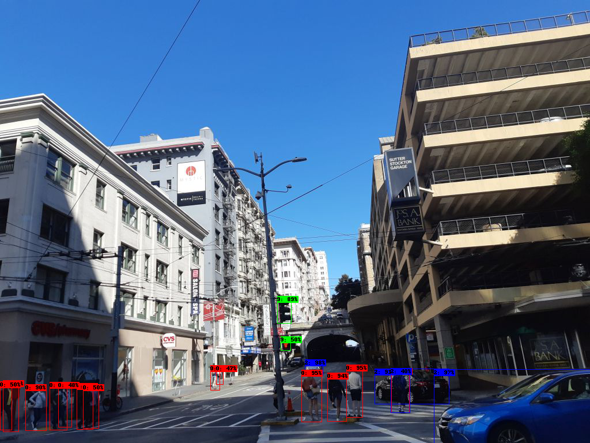

# tf-yolov4

YOLOv4 implementation with Tensorflow 2.

## Example
```python
import numpy as np
import PIL.Image
import yolov4

# Default: num_classes=80
yo = yolov4.YOLOv4(num_classes=80)

# Default: weights_path=None
# num_classes=80 and weights_path=None: Pre-trained COCO model will be loaded.
# num_classes!=80 and weights_path=None: Pre-trained backbone and SPP model will be loaded.
# Otherwise: User-defined weight file will be loaded.
yo.load_weights(weights_path=None)

img = np.array(PIL.Image.open('./data/sf.jpg'))

# The image with predicted bounding-boxes is created if `debug=True`
yo.predict(img, debug=True)
```


## TODO
* [x] Prediction
* [x] Load Darknet weight file
* [x] Pre-trained model
* [x] Basic training function and Loss definition
* [ ] Label-smoothed BCE loss
* [ ] c-IoU loss
* [ ] Training data augmentation
